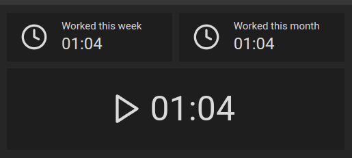
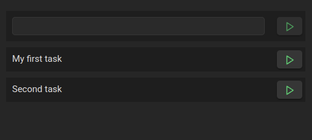
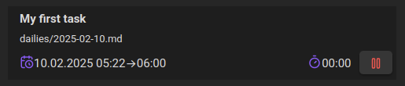
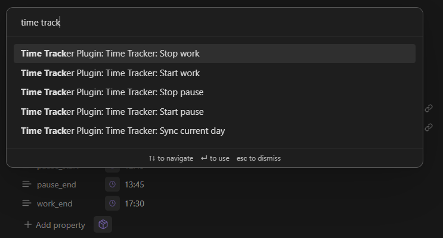
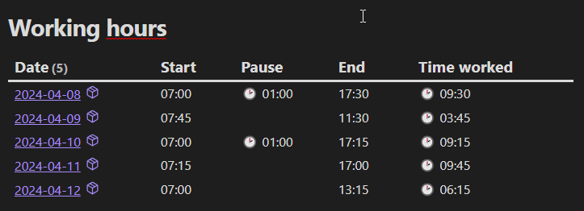

<h1 align="center">Obsidian Time-Tracker</h1>

Time Tracker for <a href="https://obsidian.md/">Obsidian</a>.

Track your times accross your entire vault. 

For changes in each release, please check the releases page: <https://github.com/senuphtyz/obsidian-time-tracker/releases>

---

# Obsidian Time-Tracker Plugin

This is a Time-Tracker plugin for Obsidian (https://obsidian.md).

## Features

* **Time Tracking**:
  Records the duration of your working time within Obsidian.

* **Task Tracking**:
  Allows you to link time logs to specific tasks, helping you organize and track timings on tasks directly within Obsidian.

* **Daily Notes Integration**:
  All tracking data data is seamlessly added to your daily notes, making it easy to review, manage your data.

* **Start/Stop Timer**:
  Start/stop your timer with a single click. Pausing automatically stops the task tracking and resume after pausing.

* **Task Tracker**:
  Task Tracker helps you monitor your tasks and prioritize them by ranking the most recently used tasks at the top.

* **Commands**:
  Commands are available for easy start / stop work or pause.

## Screenshots

 
Start / Stop / pause easily with a single click.

 
Track tasks and prioritize them by ranking the recently used tasks at the top.
First empty element is omnibox either to search for a task or to simple start a one time task.

 
Shows the currently running task the progress and the last time a progress on that task was made.

 
Commands to easy start / stop work or pause.

 
Overview over your current work. (Created with dataview)

## Requirements

* Obsidian v1.7.0 or later
* Dataview v0.5.66 or later
* A daily note for today with frontmatter

## Installation

### Manual Installation

Download the latest release from the Releases page. 
Extract the contents into your Obsidian vault's plugin directory: VaultFolder/.obsidian/plugins/time-tracker/.

### Community Plugins

Not yet available.

