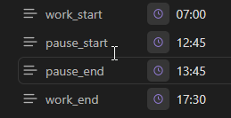

<h1 align="center">Obsidian Time-Tracker</h1>

Time Tracker for <a href="https://obsidian.md/">Obsidian</a>.

Track your times accross your entire vault. 

For changes in each release, please check the releases page: <https://github.com/senuphtyz/obsidian-time-tracker/releases>

---

# Obsidian Time-Tracker Plugin

This is a Time-Tracker plugin for Obsidian (https://obsidian.md).

## Screenshots

 
Commands to easy start / stop work or pause and synchronize timings with [MobaTime](https://www.buerk-mobatime.de/).

 
Properties in daily note.

 
Overview over your current work.

## Manually installing the plugin

- Copy over `main.js`, `styles.css`, `manifest.json` to your vault `VaultFolder/.obsidian/plugins/time-tracker/`.

